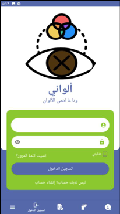
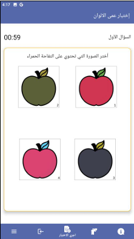
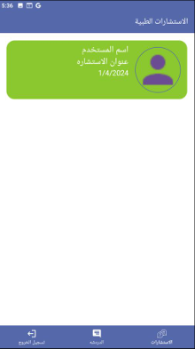

Alwany App – Color Blindness Assistance Android Application

 Project Overview

Alwany App is an Android application designed to support people with color vision deficiency (color blindness).
The app provides tools for color detection, testing, visual guidance, and consultations to help users better understand and interact with colors in daily life.

 Key Features
	• Color detection and real-time color prediction
	• Color blindness testing
	• Educational color guides
	• Consultation system with doctors
	• Push notifications
	• Admin panel for managing content and users

 Technologies Used
	• Android (Java)
	• Firebase Authentication & Cloud Messaging
	• REST APIs
	• MVVM Architecture
	• XML UI Design

 Application Screenshots

Project Structure

The project follows a clean and modular architecture:
	• Data Layer – API handling and repositories
	• Domain Layer – business logic and models
	• Presentation Layer – UI and ViewModels

 How to Run
	1.Clone the repository
	2.Open in Android Studio
	3.Sync Gradle
	4.Run on emulator or physical device

 Skills Demonstrated
	• Android App Development
	• Clean Architecture & MVVM
	• API Integration
	• Firebase Services
	• UI/UX Implementation

 Future Improvements
	• More accessibility tools
	• Advanced color correction filters
	• AI-based color recognition

 Author

Rawan – Computer Science Graduate
